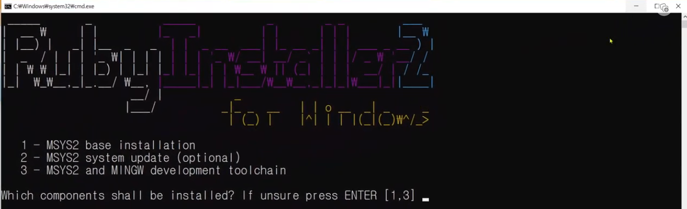
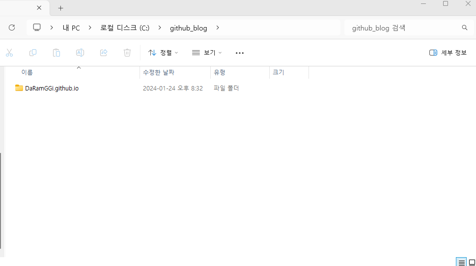
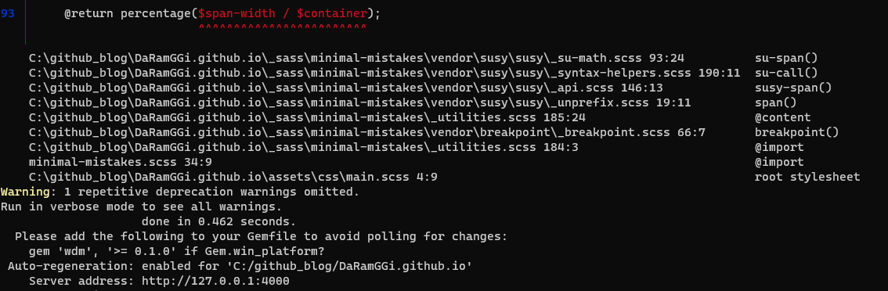

# 루비를 이용하여 로컬 서버로 블로그 작성글을 실시간으로 확인이 가능하다.

글을 작성하기전 이미 설치가 끝났으므로 진행사항은 유튜브 사진으로 대처

[Installation - Minimal Mistakes (mmistakes.github.io)](https://mmistakes.github.io/minimal-mistakes/docs/installation/)

접속후에 install dependecies항문에서 official documentaiton에 들어 간다([Installation - Minimal Mistakes (mmistakes.github.io)](https://mmistakes.github.io/minimal-mistakes/docs/installation/)).

 

여기서  Prerequisites 의  [Requirements](https://jekyllrb.com/docs/installation/#requirements)로 들어가서

[Ruby](https://www.ruby-lang.org/en/downloads/)로 입장

이후 각자 맞는 OS를 맞게 들어간다.

윈도우의 경우에는  [RubyInstaller](https://rubyinstaller.org/)

이후 Downloads 에서 최신 devkit을 설치

작성자는 3.2.2-1 설치를 진행함

설치 완료시에

이 화면에서 3번을 눌러 인스톨을 진행 

설치 완료후에 window + r -> 실행 -> cmd 

명령문  :  gem install jekyll

설치 완료시

다시 명령문 : gem install bundler

설치완료시

자신에 블로그 풀더로 들어가서 shift + 우클릭 -> power sell 창을 열어준다.

명령어 : cd  .\자신의 디텍토리 주소(예:DaRamGGi.github.io)\

(cd : 이동하는 명령어)

명령어 : ls (자신이 이동한 풀더안에 어떤 파일이 있는지 확인)

이후 bundle install 입력후 디텍토리에 다운

명령어 : bundle exec jekyll serve

서버를 구동시킨다

이러한 창이 나올시 구동 성공

Server address: http://127.0.0.1:4000

이게 나의 서버주소

주소의 내용은 내 ip와  포트번호가 부여된다 (예 : 4000)

이후 그 주소를 브라우저에서 들어가면 된다.

이후 내가 서버를 구동 시키고 싶다면

1. 내가 구동 시키고싶은 디텍토리에 가서 파워셀을 연다 (shift+우클릭)
2. 그안에서 다시 디텍토리 파일 안으로 이동한다. (예시:cd .\DaRamGGi.github.io\)
3. bundle exec jekyll serve 이걸로 서버를 구동 시킨다
4. 서버 주소를 받았으면 그 서버 주소로가서 내가 작성한 파일들을 실시간으로 확인한다.

