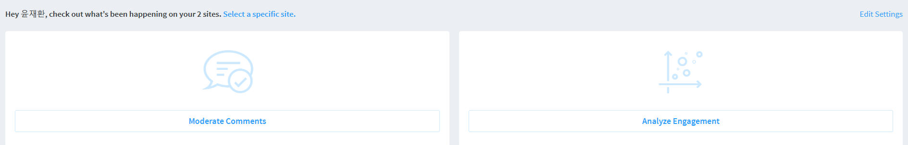
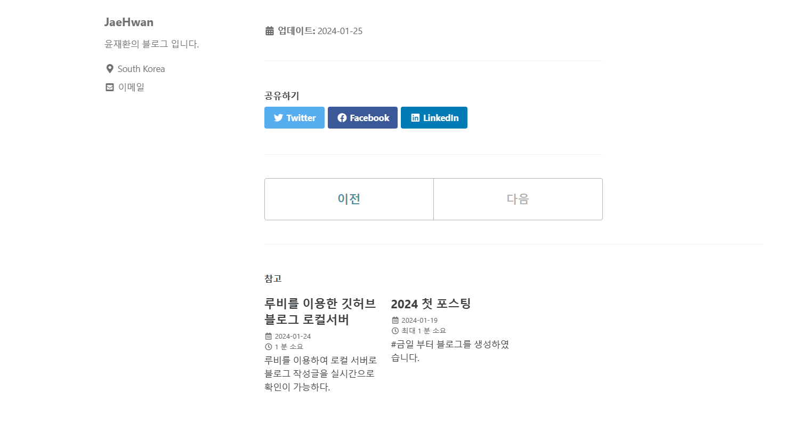

---

layout: single

title:  "Disqus를 이용한 블로그 댓글기능 사용"

categories: coding

tag: blog
---

# 블로그에 댓글을 추가한다.

이번에도 minimal-mistakes에 작성대있는데 토대로 만든다.

1. [#1 in audience engagement and community growth | Disqus](https://disqus.com/) 에 접속한후에 회원가입후 로그인을 한다.

2. 

   자신의 프로필에 마우스 오버를 한후 settings를 클릭
   

3. 
   이후 우측 상단에 다시 add Disqus To Site 클릭

4. 맨 아래로 내려가서
   
   Get Started 클릭

   

5. 
   우측 클릭

   

6. 

   본인은 해당 설정대로 했다.

   

7. 
   무료 버전을 사용 할 예정이라 billed는 한번 클릭하여 monthly로 만든후

subscribe Now 를 클릭

8. 
   이 블로그는 jekyll을 사용중이므로  jekyll 클릭
9. 
   이렇게 instructions 가 나왔지만 이건 나중에 하기로한다.
10. 
    여기서는 website URL만 설정 이후 Next
11. 
    Complete Setup을 클릭
12. 
    해당 문구가 나올시 성공.
13. 
    이후 자신의 깃허브 블로그 코드로 들어와서
    comments: #true의 주석을 풀어
    comments:true로 변경
14. 
    provider의  #false앞에 "disqus" 추가
15. 
    다시 disqus사이트에 접속해 site Admin 클릭
16. 
    맨위에 your 2sites 가 나와있는 점이 의문이지만
    우선 select a specific site. 클릭하자.
17. 
    아래에 있는게 확실한 주소이니 아래 껄로 누르자.
18. 
    해당 및줄친 부분이 short name가 된다.
19. 
    shortname 부분을 위에 서 밑줄친 부분을 복사한후 적용한다.
20. 
    이후 로컬 서버를 재실행 해도 확인이 안되는걸 볼수있다.
    이유는 disqus가 서버주소를 읽고 댓글들을 뿌려주는 현제 접속한건 로컬 서버라 적용이 안되는 모습을 볼수있다.
21. 
    이후 자신의 게시글에 들어가면 잘 적용된걸 확인할 수 있다.