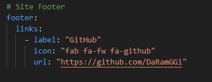

---

layout: single

title: "태그설정과 rouge를 이용한 코드 이쁘게 만들"

---
# 깃허브 태그 설정과 rouge을 이용한 코드 이쁘게만들기

1. 

   #Site Author 에서 필요 기능들을 작성한다
   해당 작성자는 트위터, 페이스북은 없으므로 삭제 시켰다.

2. 
   foorter 같은경우도 깃허브를 제외한 인스타그렘, 트위터 ,페이스북, gitlab이 없으니 지우고  github만 남겼다.

3. 이제 내가 작성한 코드들을 보다 가독성이 쉽게 색을 입히는 작업을 할것이다.
   이러한 작업은  Markdown processing인 "Kramdown"과  "Rouge"의 syntax hightlighting를 이용할것이다.

   이러한기능은 minimal-mistakes를 작성하신분이 이미 만들어 놓았다.

   
   markdown은 kramdown으로 작성되어있고
   highlighter는 rouge로 되어있다.

4. 이러한 기능들을 이용하여 내 블로그 게시글에 자바코드를 보다 이쁘게 사용할수 있게 되었다.
   예를 들어 내가 포트폴리오로 작성한 RecipeController의 코드를 하나 가져오겠다.
   
   ~~~java
	@PostMapping("commentProc")
	public String commentProc(HttpSession session, CommentDTO commentDto, Model model) {
   	recipeService.commentProc(commentDto);
	
		
		return "redirect:/recipeBoardContent?num=" + commentDto.getRe_no();
   }
   
   ~~~

   해당 기능 이용 방법은 "~~~" 작성후 java, python등 원하는 언어를 작성하면 된다.
   
   

