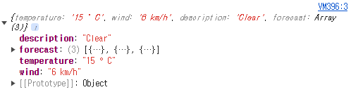
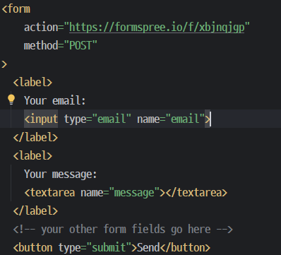

---

layout: single

title: "API 공부"

categories: coding

tag: [blog, api]

toc: true

---

# API

해당 글은 유튜브 조코딩 JoCoding의 유튜브를 보고 작성한다.

## API의 개념

Application
Programming
Interface
의 앞글자만 따서 API라고 부른다.

## AIP가이드


①요청(request)

여기서 전송 방식: "GET"은

해당 주소창 즉 "1."에 해당하는 주소에 포함시켜서 전송하는 것이 GET방식이고

해당 주소창에 포함하지 않은 채로 보내는게 POST방식이다.

이후 "3." 의 보낼것, 즉 옵션들을 추가로 보내는것이다.


②응답(response)

"1.형식"은 JSON, XML등으로 전송이 가능하다.

"2.응답"은 저렇게 날라온다는걸 말한다.


### JSON

JSON

JavaScript Object Notation 의 약자, "자료의 형식"이다.


키와 값 (이름:값)의 패턴으로 표현

{}사이에 데이터를 넣어야함

예시:

{

​	"이름" : "홍길동",

​	"특기" : ["농구, "도술"],

​	"가족관계" : {"#" : 2, "아버지" : "홍판서", "어머니" : "춘섬"}

}

### AJAX

AJAX란 보통 웹사이트에서 정보를 요청할떄

주소를 들어가 브라우저가 새로고침을 함으로써 정보를 불러오지만


AJAX를 이용시 페이지는 그대로지만 정보만 쏙 빼올수 있다.


해당 기능은 "자취세끼"라는 프로젝트를 만들떄 댓글 작성 버튼에 적용한 그 기능이다.


AJAX를 요청 하는 방법은

XMLHttpRequest - "자취세끼" 프로젝트떄 사용한 기능

jQquery Ajax

fetch - 최신 표준


###  fetch를 이용한 날씨 api 활용 방법


날씨를 받기위한 간단한 html을 작성 

이후 실행시

이렇게 간단한 실행창이 나온다

이제 날씨 api 사이트를 이용해서 해당 주소로 ajax로 값을 가져와 보는 것을 해보도록 하자


fetch('어디서 요청할 것인지')

.then((response) => response.json()) 

=http요청에 대한 응답을 sjon 데이터로 변환 하는데 사용

.then((data) => console.log(data));

=then에서 json형식의 데이터를 받아서 콘솔로 출력


해당 코드를 크롬 개발자 도구(f12)를 이용해 콘솔에 출력해보자


출력시 해당 코드가 잠시 나오고(정보를 기다리는 상태.)


출력 값이 제대로 나오는걸 확인  할 수 있다.
해당 출력값은 json형태로 넘어왔고

forecast(키) :   value가 있다.


### JSON응답 처리 방법 실습


임시로 해당 정보들을 myjson 에 담았다.

let = 변수를 선언하는 javaScript 키워드

myJson  = 변수이름

{}안의 값들 = 키와 값의 쌍

키= 값에 접근하기위한 식별


 myJson(변수이름)['키값'] 으로 해당 키값에 대한 값을 가져올수 있다. 


해당 항문에서 "특기"는 농구, 도술 이 있다.

그중에 도술을 가져오고 싶을 시에

농구,  도술

   0        1

가져오고 싶은 키값을 닫고 가져오고 싶은 번호를 [번호] 이렇게 추가로 가져오면 된다.


여기서 '값'을 입력하고 '키'를 가져오는건 불가는하다.

### api적용하기


위에서 콘솔로 출력한 api를 해당 html에 적용해보자


우선 스크립트로 

```
function getWeather(){
  fetch('http://goweather.herokuapp.com/weather/Gangneung')
.then((response) => response.json())
.then((data) => {
    document.getElementById("temperature").innerHTML = data['temperature']});
}
```

작성


처음에서는 콘솔로 출력했지만


이번엔 html엘리먼트 내용으로 설정하여 <p>태그에 적용한다.


오류 없이 잘 불러 온다.


이제 input값을 넣어서 원하는 도시의 날씨를 나오게 해보자


바뀐거는 city라는 input값, city라는 변수를 만들어서 fetch의 마지막 부분에 city라는 변수를 추가 했다.


구현은 했지만 해당 api의 서버가 불안정한지 되다가 안됬다가 한다.


### 백엔드 대체하는 api활용

formspree라는 사이트를 이용하여 만들것이다.


해당 사이트에서 로그인을 한후 form을 만들어준 후에 integration에서 Your form's endpoint is: 아래에 있는 해당 주소 방식으로 요청을 한다.


해당 주소로 요청을 받는 예제도 많이 있다. 

html, ajax등 다양하다.




html예제로 실습을 해보겠다.


해당 api주소 태그가 form에 입력이 되어 있으면 해당 주소로 이동하게 되어 있다.


위에는 해당 코드로 나온 결과창에다가 값을 입력한것이다.

email쪽은  input 타입이 email이라 한글로 입력하면 오류가 나오며 send를 보낼시에 


해당 창이 나오면


formspree홈페이지 내 계정안에 해당 데이터가 잘 들어온것을 확인 할 수 있다.

### CORS

해당 오류는 내가 날씨 API를 불러오다가 계속 거친 문제다.

