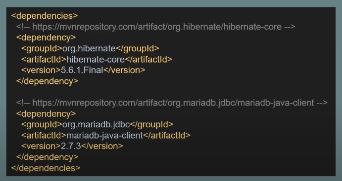

---

layout: single

title: "JPA 개념"

categories: coding

tag: [blog, JPA]

toc: true

---

# JPA

## JPA란

JPA란 Java Persistence API의 약자

자바의 ORM(Object relational Mapping) 표준 스펙을 정의

JPA의 스펙은 자바의 객체와 데이터베이스를 어떻게 매핑하고 동작해야 하는지를 정의 하고 있음.

application에서 jpa를 통해 데이터베이스의 컬럼값을 맵핑 시켜준다.

## 하이버네이트(Hibernate)

ORM Framework중 하나. 'JPA 프로바이더'라고도 부름

JPA의 실제 구현체 중 하나이며, 현재 JPA 구현체 중 가장 많이 사용됨

해당 사진에서

EclipseLink, DataNucleus 보다는

Hibernate를 더 자주쓴다.

## 영속성 컨텍스트 (Persistence Context)

"영속성 컨텍스트"는 JPA가 관리하는 엔티티 객체의 집함

엔티티 객체가 영속 컨텍스트에 들어오게 되면 JPA는 엔티티 객체의 맵핑 정보를 가지고 DB에 반영

엔티티 객체가 영속 컨텍스트에 들어오게 되어 관리 대상이 되면 그 객체를 영속 객체라고 부름

ps.여기서 엔티티는 고유 객체, 즉 기본키 같은 거라고 생각 하면된다.

영속성 컨텍스트는 세션 단위로 생명주기를 갖고 있음(세션이 생기면 만들어지고 종료되면 없어짐)

영속성 컨텍스트에 접근하기 위해서 EntityManager를 사용

EntityManager : 데이터베이스와 상호 작용을 관리하고 영속성 컨텍스트를 관리하는 역활

EntityManager는 하나의 세션으로 보고 아래와 같은 방식으로 동작을 구성

1. EntityManager 생성 (EntityManagerFactory 를 통해 생성)
2. EntityManager가 가지고 있는 트랜잭션(Transaction)을 시작
3. EntityManager를 통해 영속 컨텍스트에 접근하고 객체를 작업
4. 트랜잭션을 커밋(Commit)하여 DB에 반영
5. EntityManager 종료

## 엔티티(Entity) 클래스

JPA어노테이션을 활용하여 엔티티 클래스를 정의 

주요 어노테이션은 아래와 같음

@Entity: 해당 클래스가 JPA 엔티티 클래스라고 정의

@Table : 해당 클래스가 데이터베이스의 어느 테이블에 매핑되는지 정의

@Id : DB 테이블의 Primary Key(기본키) 칼럼과 매핑

@Column : 매핑할 데이터베이스의 칼럼 이름과 필드 변수의 이름이 다를 경우 매핑하기 위해 사용

ps. 매핑 : 객체와 데이터베이스 간의 상호 작용

## Dependencty 설정

해당 코드는 maven으로 작성 되었으면 

해당 gradle에서 작성할시 맨위 jpa와 맨 아래 mariaDB를 추가 한다(DB선택은 자유다.)