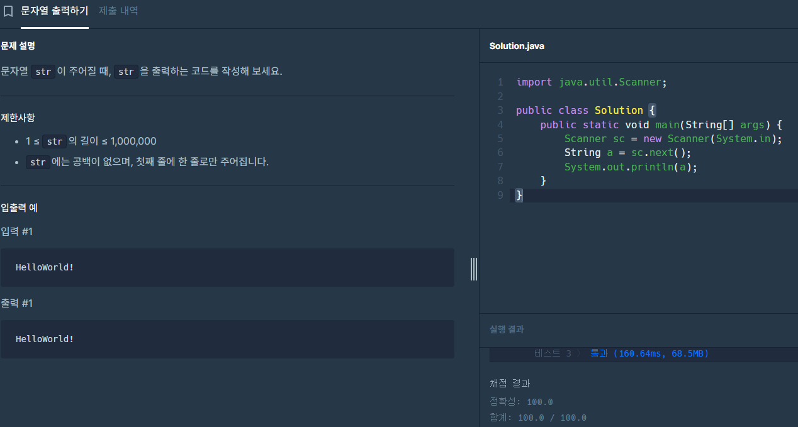
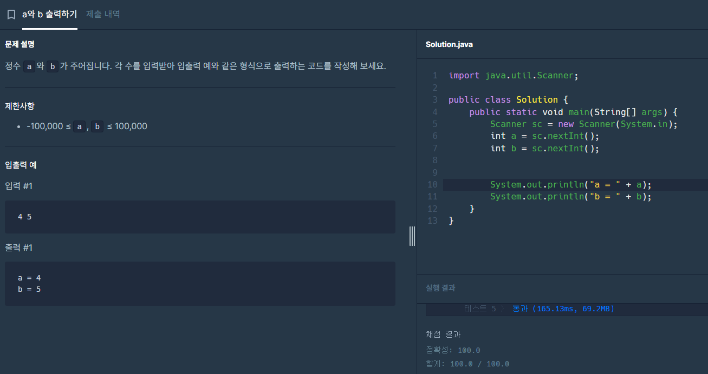

---

layout: single

title: "프로그래머스 문제 연습"

categories: coding

tag: [blog, 프로그래머스]

toc: true
---

# 프로그래머스
## 문제 1



 큰 문제 없이 그양 sysout으로 a가 출력 되게 만들었다.


## 문제 2



이번 문제도 a와 b가 입력받은걸 출력 하는 문제였다.

하지만 출력 예시를 잘못 보아서 

```java
System.out.println(a);
System.out.println(b);
```

이렇게 작성하여 처음에는 왜 틀렸다 제한사항 처럼 if문을 넣어 봤지만 그저 출력 예시 오류 였다..

