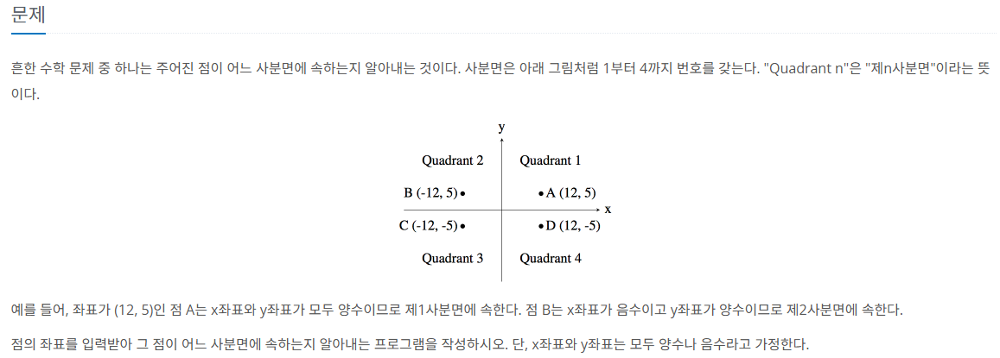
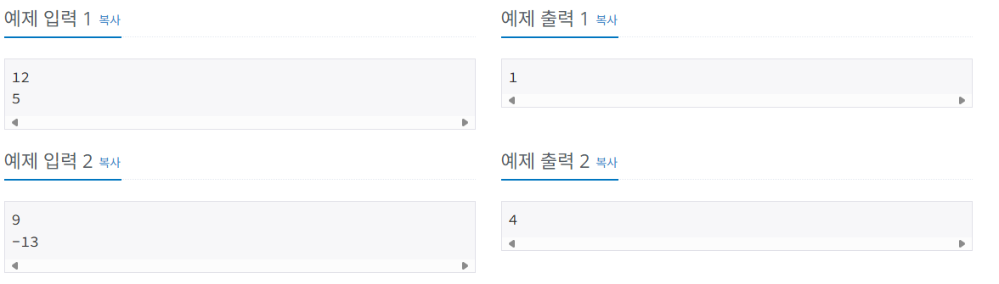

---

layout: single

title: "백준-5"

categories: coding

tag: [blog, 백준]

toc: true

---
# 백준 실습

## 사분면 고르기





문제는 뭔가 그레프를 그려야 할거 같지만 그양 if문 써서 어떤 상황일떄의 값을 주면 해결 된다.


```java
Scanner sc = new Scanner(System.in);
		int x,y;
		x = sc.nextInt();
		y = sc.nextInt();
		int a = 1;
		int b = 2;
		int c = 3;
		int d = 4;
		
		
		if(x >= 1 && y >= 1) {
			System.out.println(a);
		}else if(x < 1 && y < 1){
			System.out.println(c);
		}else if(x < 1 && y >= 1) {
			System.out.println(b);
		}else if(x >= 1 && y < 1) {
			System.out.println(d);
		}
```

