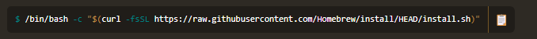

---

layout: single

title: "맥북 설정"

categories: coding

tag: [blog, 백준]

toc: true

---
# 맥북 초기설정
## Homebrew 설치

[Homebrew — The Missing Package Manager for macOS (or Linux)](https://brew.sh/)

해당 사이트에서 Homebrew 터미널을 이용해서 설치한다 



해당 코드를 터미널에 입력하면 설치 완료.

이후  brew를 쓸려고해도 환경변수가 설정이 안되어 있어

PATH설정을 해야한다.

### PATH 설정

아래의 명령어로 vim 에디터로 .zshrc문서가 열린다.

```
vi ~/.zshrc
```

i를 눌러서  insert모드로 변경 후 다음과 같이 입력한다.

``` 
export PATH=/opt/homebrew/bin:$PATH
```

입력 완료후 esc를 누른후 :wq 눌러서vim에서 작성한 내용을 저장합니다.


다시 터미널에서 아래 명령어를 실행하여 변경사항 적용

```
source ~/.zshrc
```

brew 버전을 확인한다.

```
brew --version
```

## 깃 연결

깃 연결은 쉽다

```
brew install git
```


 ```
 git config --global user.name ""
 git config --global user.email ""
 ```

## vs코드 다운로드

